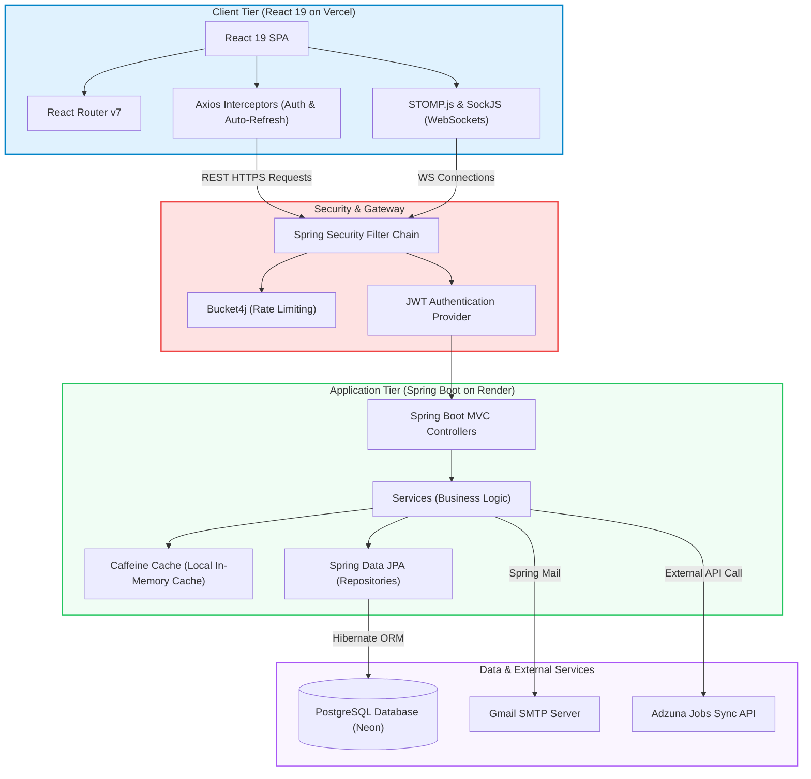

# JobVista
A production-grade, highly responsive full-stack job portal and talent acquisition platform.

Spring Boot React PostgreSQL WebSockets Caffeine-Cache Flyway Docker

🚀 Overview
JobVista is a production-ready, full-stack job portal designed to connect candidates with opportunities seamlessly. Job seeker candidates can browse, search, and apply to jobs in real-time, while corporate partners and platform administrators can manage job postings, process candidates, track system metrics, and sync external jobs via third-party APIs.

Built with a performance-first architecture, the platform includes stateless JWT authentication with secure HTTP-only cookies, robust in-memory caching, real-time status updates via WebSockets, and fully automated deployment configurations.

✨ Key Features
- **Candidate Workspace**: Browse, search, and filter job postings. Apply with a single click, bookmark opportunities, track application histories, and upload PDF resumes.
- **Corporate Control Center**: Empower companies to post, update, and manage job listings, track applicants, and adjust application statuses dynamically.
- **Admin Control Console**: Monitor platform-wide metrics, oversee company and user directories, and trigger background synchronizations with external job boards.
- **Real-Time Job Sync**: Live application updates and status changes streamed straight to the user dashboard using STOMP WebSockets.
- **Enterprise Security**: Secure session management with HTTP-only Refresh Token cookies, in-memory Access Tokens, strict CORS controls, and input/file validation.
- **Flyway Migrations**: Production database changes are fully controlled and tracked via versioned SQL migration scripts.
- **Automated CI/CD**: Seamless verification pipeline that compiles and builds frontend and backend code on every push.

🏗 Architecture Diagram




### Key Architectural Concepts
- **Decoupled JWT Auth**: Stateless Access Tokens (15-min TTL) in React state combined with Secure, HttpOnly, SameSite Cookies for Refresh Tokens (7-day TTL).
- **IP-Based Rate Limiting**: Managed at the gateway/filter level using Bucket4j to prevent brute-force attacks on authenticating endpoints.
- **WebSocket Auth Integration**: Custom Stomp channel interceptors handle incoming JWT validation headers, securing real-time client socket connections.
- **Caffeine Local Cache**: Placed on high-traffic data views (e.g. active job listings, partner directories) with auto-eviction and 5-minute TTL constraints to alleviate DB loads.
- **Schema Control**: Database schema evolutions are governed through SQL scripts managed by Flyway.

🛠 Tech Stack
- **Frontend**: React 19, Vite, Axios, STOMP.js, SockJS, React Router v7, Lucide React, CSS
- **Backend**: Spring Boot 3.x, Spring Security, Spring WebSockets, Spring Data JPA, Java 17
- **Database**: PostgreSQL (Neon Cloud / Render), Caffeine Cache (Local In-Memory)
- **Infrastructure**: Docker, GitHub Actions (CI/CD), Render, Vercel

📸 Screenshots

### Landing Page & Authentication
| Landing Page | Login Page | signup page |
| :---: | :---: | :---: |
|  |  |  |

### Dashboards & Management
| Admin Dashboard | Company Dashboard | Post a Job |
| :---: | :---: | :---: |
|  |  |  |

### Candidate Experience
| Jobs Directory | Resume Builder | Company Directory |
| :---: | :---: | :---: |
|  |  |  |

💻 Local Setup & Deployment
Want to run this yourself? Follow the steps below:

#### 1. Clone the Repository
```bash
git clone https://github.com/jayswalhimanshu74-cmd/JobVista.git
cd JobVista
```

#### 2. Backend Configuration
Create a `.env` file at the root of the project:
```env
DB_URL=jdbc:postgresql://localhost:5432/jobvista
DB_USERNAME=postgres
DB_PASSWORD=your_password
JWT_SECRET_KEY=your_secret_minimum_32_chars
ADMIN_PASSWORD=your_admin_password
MAIL_USERNAME=your_email@gmail.com
GMAIL_APP_PASSWORD=your_gmail_app_password
ADZUNA_APP_ID=your_adzuna_app_id
ADZUNA_APP_KEY=your_adzuna_app_key
VITE_API_BASE_URL=http://localhost:8080/api/v1
VITE_WS_URL=http://localhost:8080
VITE_IMAGE_BASE_URL=http://localhost:8080
```
Run the Spring Boot application:
```bash
cd backend
./mvnw spring-boot:run
```
The backend API is accessible at: `http://localhost:8080`

#### 3. Frontend Configuration
Navigate to the frontend folder and install dependencies:
```bash
cd frontend
npm install
npm run dev
```
The React development server runs at: `http://localhost:5173`

🔒 Security Features
Security is prioritized across all layers of the JobVista application architecture:
- **XSS Mitigation**: In-memory token storage prevents malicious scripts from scraping access credentials from localStorage.
- **CSRF Defense**: Refresh tokens are isolated inside HttpOnly cookie scopes with strict SameSite restrictions.
- **Payload Validation**: Hard whitelists enforce PDF-only resume uploads and strict MIME-type file parsing.
- **Fail-Fast Security Init**: System rejects boots when JWT configuration credentials or encryption keys are weak.
- **Role-Based Guards**: Method-level security restrictions ensure company and admin operations are locked to matching users.

🔮 Future Improvements
- **Redis Cache Tier**: Upgrading from local Caffeine memory to Redis cluster to enable distributed caching.
- **AWS S3 File Storage**: Transition local uploads (resumes/banners) to S3/Cloudflare R2 buckets for persistent, highly-available file access.
- **AI Resume Analysis**: Integrate candidate resume parsing algorithms to auto-extract capabilities and match them against jobs.
- **Security Checkpoints**: Email verification links on candidate signups and password recovery.

🤝 Contributing
Contributions, bug reports, and features are welcome! Feel free to open issues or file pull requests.

📄 License
This project is open-source and licensed under the MIT License.